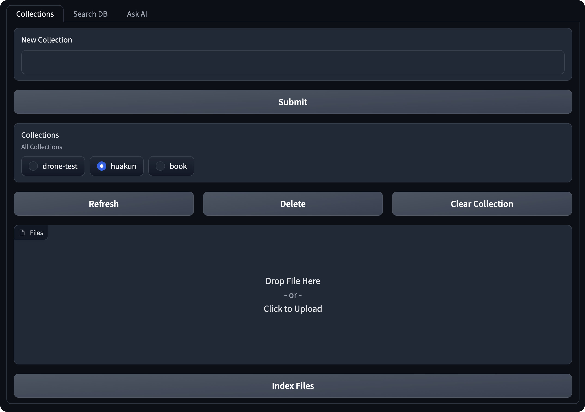
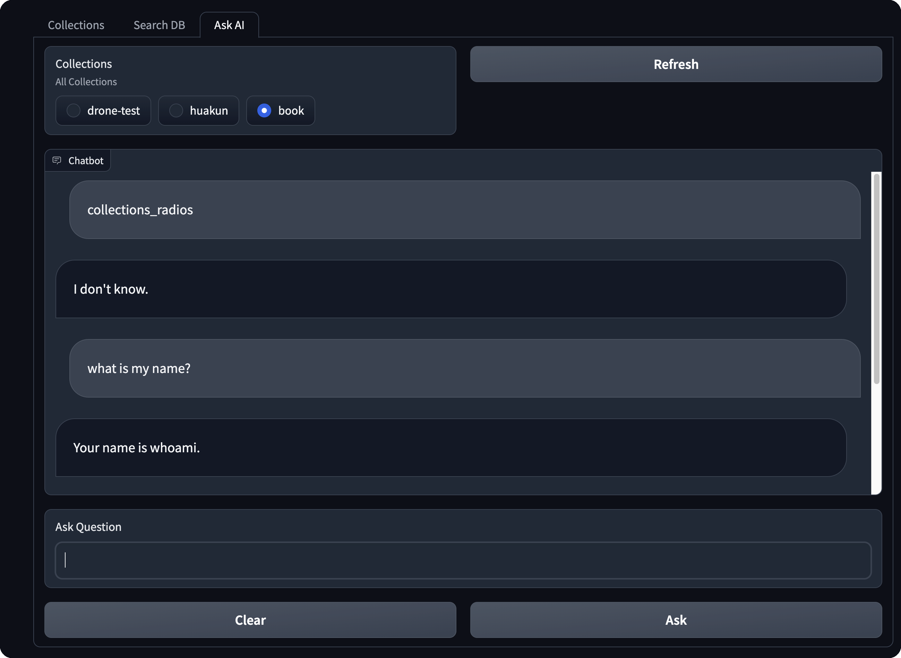

# My RAG

This is a simple RAG (Retrieval Augmented Generation) app built with Gradio and Supabase.

Supabase is used mainly as a vector database and and used to store document hash data to prevent duplicate documents from being stored.

Langchain is used for interacting with Vectorbase, but the `SupabaseVectorStore` vector store class has been customized to make filtering easier to support more columns.

Use [init.sql](./supabase/functions/init.sql) to initialize supabase database and functions.

https://python.langchain.com/docs/integrations/vectorstores/supabase

The UI is built with gradio. You can create collection and index documents. You can also search for documents and view them and ask AI to interpret the documents.

